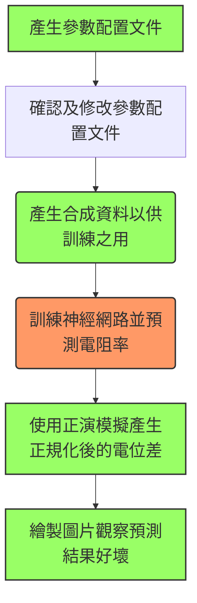

# erinn Manual

## 安裝(Installation)

由於本套件使用python和matlab編寫，所以需要讓兩者都可以找到本套件。

### matlab安裝erinn

```matlab
addpath(genpath('/path/to/erinn'));
```
### python安裝erinn

```
1. 將整個erinn整個資料夾放進PYTHON的搜尋路徑
2. 可以設定額外PYTHONPATH環境變數，令PYTHON可以搜尋到新的路徑
```

---


## 使用範例(Example)



> 綠色是使用matlab 橘色是使用python


### 產生參數配置文件

<span style="background: rgba(200,150,150,1)">請根據場址條件慎選亂數生成函數</span>

```matlab
% 產生預設的參數配置文件
gen_config_json();
% 指定幾何urf檔
gen_config_json('urf', '/path/to/geo_urf');
% 指定亂數生成的函數 (此功能尚未完善)
gen_config_json('core', 'rand_block');
```


### 確認及修改參數配置文件

<span style="background: rgba(200,150,150,1)">請根據場址條件慎選參數</span>

```json
{
    "output_path": "./synthetic_data",
    "nx": 100,
    "nz": 50,
    "simulate": {
        "geomatry_urf": "geo.urf",
        "Para_mat": "fw2_5D_para.mat"
    },
    "generator": {
        "core": "rand_block",
        "samples": 2000,
        "mu": 5.521460917862246,
        "std": 1.1314021114911007,
        "block_x_min": 3,
        "block_x_max": 50,
        "block_z_min": 3,
        "block_z_max": 50
    }
}
```

>  內部參數詳細說明請參閱???


### 產生合成資料

```matlab
config_json1 = 'path/to/config_json1';
config_json2 = 'path/to/config_json2';
% 可以產生不同配置的合成資料
gen_data(config_json1);
gen_data(config_json2);
```


### 訓練神經網路、預測電阻率

這部分需要對模型進行調整，因此僅對輸入/輸出進行範例說明

```python
# generate source hdf5 file
src_h5 = 'src.h5'
config_file = '/path/to/config_json'
utils.gen_glob_para_h5(config_file, src_h5)

# load
train_data_path = ['1.h5', '2.h5']
x, y = utils.read_raw_data(train_data_path)

# save
urf_dir = '/path/to/urf_dir'
dest_h5 = '/hdf5/path/to/save'
used_data = ((x_train, y_train), (x_test, y_test))
synth_data = (x_test, y_test)
utils.save_nn_model(model, output_dir=trained_model_path, model_name='model.h5')
utils.save_used_data(model, src_h5, used_data, dest_h5=dest_h5)
utils.save_synth_data(model, dest_h5, synth_data)
utils.save_daily_data(model, dest_h5, urf_dir)
```


### 預測正規化後的電位差($\Delta V/I$)

```matlab
NN_dir = '/path/to/model dir';
config_json = '/path/to/config_json';
h5 = fullfile(NN_dir, 'data.h5');
para = jsondecode(fileread(config_json));

%% synthetic data: predict V/I
% synth_data is a structure
synth_data = load_synth_data(h5);
pred_log_rho = synth_data.pred_log_rho;
sigma = 1./10.^pred_log_rho;
simu_para = fwd_simu_para(para);
pred_V = fwd_simu(sigma, simu_para);
save_synth_predV(h5, pred_V);

%% daily data: predict V/I
% daily_data is a table
daily_data = load_daily_data(h5);
pred_log_rho = daily_data{:, 'pred_log_rho'};
% or use: pred_log_rho = daily_data.pred_log_rho;
sigma = 1./10.^pred_log_rho;
simu_para = fwd_simu_para(para);
pred_V = fwd_simu(sigma, simu_para);
% *Because we have to use date information, we pass all table
daily_data = addvars(daily_data, pred_V, 'Before','pred_log_rho');
% or use: daily_data.pred_V = pred_V;
save_daily_predV(h5, daily_data);
```


### 繪製圖片

```matlab
NN_dir = '/path/to/model dir';
config_json = '/path/to/config_json';
h5 = fullfile(NN_dir, 'data.h5');
para = jsondecode(fileread(config_json));
synth_data = load_synth_data(h5);
daily_data = load_daily_data(h5);

%% synthetic data: crossplot(synth_V v.s. pred_V)
for i = 1:size(synth_data.synth_V, 1)
   fig = crossplot_synth(synth_data.synth_V(i, :), synth_data.pred_V(i, :));
   
   % ---- adjust figure object ----
   % ax = fig.Children(1);
   % t = ax.Children(1);
   % t.FontSize = 12;
   
   % ---- you can save this figure ----
   % print(fig, ......);
   pause(1); close(fig);
end

%% synthetic data: subsurface structureplot
nx = para.nx;
nz = para.nz;
coord = h5read(h5, '/glob_para/coord_in_model');
xz = coord(:, [2, 4]) + [nx/2, 0];
for i = 1:size(synth_data.synth_log_rho, 1)
    synth_log_rho = reshape(synth_data.synth_log_rho(i, :), nx, nz)';
    pred_log_rho = reshape(synth_data.pred_log_rho(i, :), nx, nz)';
    fig = structureplot_synth(synth_log_rho, pred_log_rho, nx, nz, xz);
    
    % ---- adjust figure object ----
    % ax1 = fig.Children(4);
    % cbar1 = fig.Children(3);
    % ax2 = fig.Children(2);
    % cbar2 = fig.Children(1);
    % caxis(ax1, [0, 2]);
    % cbar1.Ticks = [0, 0.5, 1, 1.5, 2];
    % cbar1.TickLabels = {'1', '3', '10', '30', '100'};
    % caxis(ax2, [0, 2]);
    % cbar2.Ticks = [0, 0.5, 1, 1.5, 2];
    % cbar2.TickLabels = {'1', '3', '10', '30', '100'};
    
    % ---- you can save this figure ----
    % print(fig, ......);
    pause(1); close(fig);
end

%% daily data: crossplot(obs_V v.s. pred_V)
for i = 1:5%size(daily_data.obs_V, 1)
    fig = crossplot_daily(daily_data.obs_V(i, :), daily_data.pred_V(i, :));
    
    % ---- add title ----
    % fig.CurrentAxes.Title.String = daily_data.date{i};
    
    % ---- you can save this figure ----
    % print(fig, ......);
    pause(1); close(fig);
end

%% daily data: subsurface structureplot
for i = 1:5%size(daily_data.obs_V, 1)
    pred_log_rho = reshape(daily_data.pred_log_rho(i, :), nx, nz)';
    fig = structureplot_daily(pred_log_rho, nx, nz, xz);
    
    
    fig.CurrentAxes.Title.String = daily_data.date{i};
    cbar = fig.Children(1);
    caxis([0, 2]);
    cbar.Ticks = [0, 0.5, 1, 1.5, 2];
    cbar.TickLabels = {'1', '3', '10', '30', '100'};
    
    % you can save this figure
    % print(fig, ......);
    pause(1); close(fig);
end
```


## erinn的HDF5儲存架構

<span style="border:2px white solid; font-size:18px; background-color:rgba(255, 0, 0, 0.5);">由於python numpy套件預設是使用C-order(Row-major order) indexing，而matlab使用Fortran-order(column-major order) indexing，所以讀取檔案時需注意是否要轉置(2維矩陣的情況)。</span>

<span style="border:2px white solid; font-size:18px; background-color:rgba(255, 0, 0, 0.5);">為求方便，統一使用研究室慣用的Fortran-order indexing，因此python在創建及讀取時要進行轉置!!! </span>

References:

​	[Row-_and_column-major_order](https://en.wikipedia.org/wiki/Row-_and_column-major_order)

​	[python-created-hdf5-dataset-transposed-in-matlab](https://stackoverflow.com/questions/21624653/python-created-hdf5-dataset-transposed-in-matlab)

### 正演模擬後的儲存架構

---

<pre>
/
  - /Inputs
  - /Targets
  - /dx
  - /dz
  - /recloc
  - /srcloc
  - /srcnum  
</pre>


**根群組(root group, /)** 底下，分別存有7個資料集(dataset)。

1. Inputs: V/I
2. Targets: 電導率
3. dx: 正演模型的寬度
4. dz: 正演模型的深度
5. recloc: 接收電極對的座標
6. srcloc: 放電電極對的座標
7. srcnum: 接收電極對所對應放電電極的編號


### 預測後的儲存架構

---

**根群組(root group, /)** 底下，分別存有 **全局參數(/glob_para)** 、 **每日電位資料(/daily_data)**、**合成資料(/synth_data)**及**使用資料(/used_data)**四個子群組，其下各別儲存相關的資料集。

<pre>
/
  /glob_para
    - /glob_para/RxP2_id
    - /glob_para/Rx_id
    - /glob_para/Tx_id
    - /glob_para/dx
    - /glob_para/dz
    - /glob_para/coord
    - /glob_para/coord_in_model
    - /glob_para/recloc
    - /glob_para/srcloc
    - /glob_para/srcnum
  /daily_data
     /daily_data/20180316
       - /daily_data/20180316/obs_V
       - /daily_data/20180316/pred_V
       - /daily_data/20180316/pred_log_rho
     /daily_data/20180321
       - /daily_data/20180321/obs_V
       - /daily_data/20180321/pred_V
       - /daily_data/20180321/pred_log_rho
     /daily_data/20180322
       - /daily_data/20180322/obs_V
       - /daily_data/20180322/pred_V
       - /daily_data/20180322/pred_log_rho
     /daily_data/20180323
       - /daily_data/20180323/obs_V
       - /daily_data/20180323/pred_V
       - /daily_data/20180323/pred_log_rho
  /synth_data
    - /synth_data/synth_V
    - /synth_data/synth_log_rho
    - /synth_data/pred_V
    - /synth_data/pred_log_rho
  /used_data
    - /used_data/x_train
    - /used_data/y_train
    - /used_data/x_test
    - /used_data/y_test
    - /used_data/x_valid (optional)
    - /used_data/y_valid (optional)
</pre>


<span style="border:2px white solid; font-size:18px; font-weight:bold; background-color:rgba(204, 204, 153, 1);">全局參數底下的資料集 :</span>
此群組底下存放正演模擬參數及描述野外陣列的資料集。

* 正演模型前置參數，可供get_2_5Dpara使用 (詳細說明請參考: [FW2_5D: A MATLAB 2.5-D electrical resistivity modeling code](https://www.sciencedirect.com/science/article/pii/S0098300408001519))
  1. dx: 正演模型的寬度
  1. dz: 正演模型的深度
  1. recloc: 接收電極對的座標
  1. srcloc: 放電電極對的座標
  1. srcnum: 接收電極對所對應放電電極的編號
  1. coord_in_model(id, x, y, z): 在正演模型中，電極編號及空間座標

* 野外現地陣列資料
  1. Rx_id: 接收電極的編號

  1. Tx_id: 放電電極的編號

  1. RxP2_id: 共負電位極的編號

  1. coord(id, x, y, z): 電極編號及空間座標


<span style="border:2px white solid; font-size:18px; font-weight:bold; background-color:rgba(204, 204, 153, 1);">每日資料底下的資料集:</span>
此群組底下有以yyyymmdd格式記述的每天分組，並在yyyymmdd群組底下存放資料集。

* /daily_data/yyyymmdd 群組下的資料集
  1. obs_V: 野外現地量測到的V/I
  $$
  s=sample\ size\\f=feature\ size\\
  obs\_V =\begin{bmatrix}
      v_{11} & v_{12} & v_{13} & \dots  & v_{1f} \\
      v_{21} & v_{22} & v_{23} & \dots  & v_{2f} \\
      \vdots & \vdots & \vdots & \ddots & \vdots \\
      v_{s1} & v_{s2} & v_{s3} & \dots  & v_{sf}
  \end{bmatrix}
  $$
  2. pred_V: 以NN模型預測的電阻率，重新輸入正演模型，模擬所得的V/I
  $$
  s=sample\ size\\f=feature\ size\\
  pred\_V =\begin{bmatrix}
      v_{11} & v_{12} & v_{13} & \dots  & v_{1f} \\
      v_{21} & v_{22} & v_{23} & \dots  & v_{2f} \\
      \vdots & \vdots & \vdots & \ddots & \vdots \\
      v_{s1} & v_{s2} & v_{s3} & \dots  & v_{sf}
  \end{bmatrix}
  $$
  3. pred_log_rho: NN模型預測的電阻率，以 $log_{10}$ *scale* 儲存
  $$
  s=sample\ size\\
  e=number\ of\ mesh\ element\ in\ forward\ model\\
  pred\_log\_rho =\begin{bmatrix}
      r_{11} & r_{12} & r_{13} & \dots  & r_{1e} \\
      r_{21} & r_{22} & r_{23} & \dots  & r_{2e} \\
      \vdots & \vdots & \vdots & \ddots & \vdots \\
      r_{s1} & r_{s2} & r_{s3} & \dots  & r_{se}
  \end{bmatrix}
  $$


<span style="border:2px white solid; font-size:18px; font-weight:bold; background-color:rgba(204, 204, 153, 1);">合成資料底下的資料集:</span>

1. synth_V: 正演模擬所得的V/I，且row可以無限增加的資料集 

$$
s=sample\ size\\
f=feature\ size\\
synth\_V =\begin{bmatrix}
    v_{11} & v_{12} & v_{13} & \dots  & v_{1f} \\
    v_{21} & v_{22} & v_{23} & \dots  & v_{2f} \\
    \vdots & \vdots & \vdots & \ddots & \vdots \\
    v_{s1} & v_{s2} & v_{s3} & \dots  & v_{sf}
\end{bmatrix}
$$

2. pred_V: 以NN模型預測的電阻率，重新輸入正演模型，模擬所得的V/I，且row可以無限增加的資料集 

$$
s=sample\ size\\
f=feature\ size\\
pred\_V =\begin{bmatrix}
    v_{11} & v_{12} & v_{13} & \dots  & v_{1f} \\
    v_{21} & v_{22} & v_{23} & \dots  & v_{2f} \\
    \vdots & \vdots & \vdots & \ddots & \vdots \\
    v_{s1} & v_{s2} & v_{s3} & \dots  & v_{sf}
\end{bmatrix}
$$

3. synth_log_rho: ，正演模擬所使用的電阻率，以 $log_{10}$ *scale* 儲存，且row可以無限增加的資料集 

$$
s=sample\ size\\
e=number\ of\ mesh\ element\ in\ forward\ model\\
synth\_log\_rho =\begin{bmatrix}
    r_{11} & r_{12} & r_{13} & \dots  & r_{1e} \\
    r_{21} & r_{22} & r_{23} & \dots  & r_{2e} \\
    \vdots & \vdots & \vdots & \ddots & \vdots \\
    r_{s1} & r_{s2} & r_{s3} & \dots  & r_{se}
\end{bmatrix}
$$

4. pred_log_rho: NN模型預測的電阻率，以 $log_{10}$ *scale* 儲存，且row可以無限增加的資料集 

$$
s=sample\ size\\
e=number\ of\ mesh\ element\ in\ forward\ model\\
pred\_log\_rho =\begin{bmatrix}
    r_{11} & r_{12} & r_{13} & \dots  & r_{1e} \\
    r_{21} & r_{22} & r_{23} & \dots  & r_{2e} \\
    \vdots & \vdots & \vdots & \ddots & \vdots \\
    r_{s1} & r_{s2} & r_{s3} & \dots  & r_{se}
\end{bmatrix}
$$


<span style="border:2px white solid; font-size:18px; font-weight:bold; background-color:rgba(204, 204, 153, 1);"> 使用資料底下的資料集:</span>

1. x_train: 用於訓練神經網路的輸入值
2. y_train: 用於訓練神經網路的輸出值
3. x_test: 用於測試神經網路的輸入值
4. y_test: 用於測試神經網路的輸出值
5. x_valid: 用於驗證神經網路的輸入值
6. y_valid: 用於驗證神經網路的輸出值